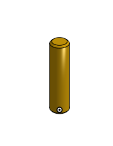

# Basic_OnShape_CAD
Basic CAD from OnShape.
## Base
### Assignment
Contruct the base for the Caster in OnShape.
### Image

### Refelction
The base is a pretty is part in my opinion but it was somewhat harder this time due to the new CAD program, but I think it will get better from this point forward.
#### Link
[Base_Caster](https://cvilleschools.onshape.com/documents/a278014bceed52d56844253e/w/d82483bf58bb72624f36bfcf/e/bbc918ac7ef183065d1d3fe4)

## Mount
### Assignment
Construct the Mount Part for the Caster in OnShape.
### Image

### Reflection
Like I said in the last reflection it is only going to get easier, the more I use it the better I'll be with OnShape. That is the only thing that is a problem.
[Mount_Caster](https://cvilleschools.onshape.com/documents/44f16a00081f7bb95b908548/w/e76a2441cafde34aac9a6822/e/7a265f981ecbd0c6844bd86f)

## Fork
### Assignment
Create the Fork part for the Caster assembly in OnShape CAD.
### Image

### Reflection
This assignment was a little bit harder than the others because we had to do somethings that I forgot how to do.
#### Link
[Fork_Caster](https://cvilleschools.onshape.com/documents/c597409a316e5715fa4ccd76/w/27e4aebcc42f2ee02951c76c/e/2f74c344cd4226b21d5edae4)

## Tire
### Assignment
Create the Tire for the Wheel of the Caster in OnShape.
### Image

### Reflection
This Assignment was probably the easiest of the ones we have had, because the only thting you need to do is make a trapzoid and revolve it around an axis and you are done.
#### Link
[Tire_Caster](https://cvilleschools.onshape.com/documents/98e130bca184aefd480b0533/w/443bf01e6d514bd2dfee2aa8/e/63a4241f91cd8070ccae86ff)

## Wheel 
### Assignment
Construct the Wheel fro the Caster in OnShape.
### Image

### Reflection
This assignment was a little bit more challenging than the others but still not to difficult. The Assembly might be a little bit harder then usual due to not having done an assebly in OnShape before.
#### Link
[Wheel_Caster](https://cvilleschools.onshape.com/documents/98e130bca184aefd480b0533/w/443bf01e6d514bd2dfee2aa8/e/25fe20a41bc280bdb66261fe)

## Axle, Collar, Bearings
### Assignments
Create the axle, collar, and the two different bearing for the final caster assembly in OnShape
### Image

### Reflection
This assignment was a little challenging mostly because it was just alot of stuff not a lot of hard things to do just the amount of different pieces was a little challenging.
#### Link
[Axle_and_Collar](https://cvilleschools.onshape.com/documents/74d7cfb8b0aeaad21995124a/w/16399554e163aded6ca79240/e/e5d891a37fcb17584f45dad2)
[Bearing](https://cvilleschools.onshape.com/documents/98e130bca184aefd480b0533/w/443bf01e6d514bd2dfee2aa8/e/25fe20a41bc280bdb66261fe)
[Bearing_2](https://cvilleschools.onshape.com/documents/78d3c54c06445aa684676912/w/e928ba8f9b79d46fed967717/e/b7f6a4c22f198125fef8544c)

## Sub-Assembly
### Assignment
Construct the sub-assembly in OnShape before finishing the final caster assembly.
### Image

### Reflection
I would have to say that this was one of the harder assignments solely because it was my first time doing an assembly in OnShape and I had to learn how to do it, which made it hard but still not incredibly difficult.
### Link
[Sub-Assembly](https://cvilleschools.onshape.com/documents/d9890880669fae9d5d28a3bf/w/71c63cb11c2bac07471e4ae4/e/276332e0672e413d2f0075e3)

## Final Caster
### Assignment
Complete the final Caster assembly in OnShape.
### Image

### Reflection
This final assembly was kind of difficult bcause there were some new thing that I had to learn that I hadn't done before in OnShape, like getting all of the mates correct Because at one point my axle was off-centered just by a tiny bit, but it made it so I had to go  back and fix it in the sub-assembly. Also learnig how to implement screws, bolts and nuts was not super easy, due to having to do it on a new syestem.
### Link
[Final_Caster](https://cvilleschools.onshape.com/documents/2b43f2715114c3d5bd413c3a/w/acb3f1d731a710d1b8ba29a2/e/becdffd2f36a31dc2f7a2da9)

## Dorothy's Dowel Pins and Picture Frame
### Assignment
Create a frame using configurations of two parts, the frame and the pins.
### Image

### Reflection
This assignment was harder than the past assignments due to the fact that I had to guess on some of the measurements, because I was not given all of them. It was also a learning expierence to learn how to use configurations in OnShape.
### Link
[Dorothy's Dowel Pins and Picture Frame](https://cvilleschools.onshape.com/documents/4628c4a2d3cd8bec670c8dfa/w/c3290220f6bdd51f67994500/e/5ea779d16e7a1471274c2b83)
