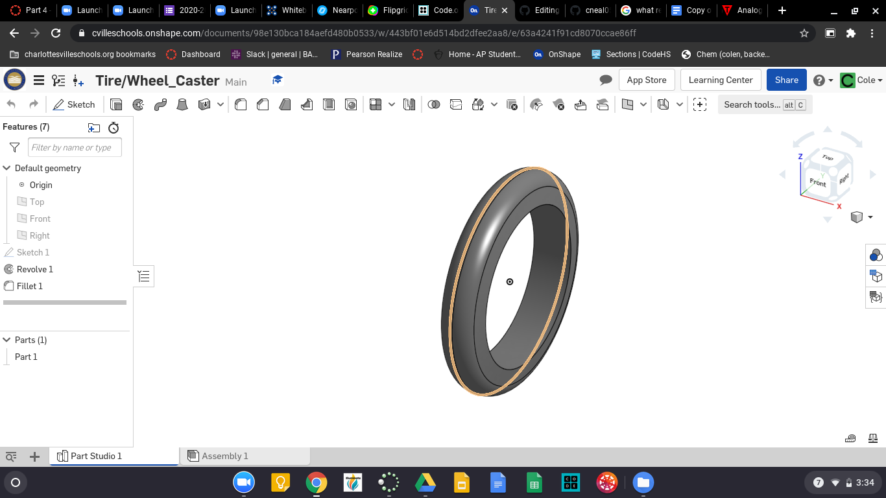

# Basic_OnShape_CAD
Basic CAD from OnShape.
## Base
### Assignment
Contruct the base for the Caster in OnShape.
### Image

### Refelction
The base is a pretty is part in my opinion but it was somewhat harder this time due to the new CAD program, but I think it will get better from this point forward.
#### Link
[Base_Caster](https://cvilleschools.onshape.com/documents/a278014bceed52d56844253e/w/d82483bf58bb72624f36bfcf/e/bbc918ac7ef183065d1d3fe4)

## Mount
### Assignment
Construct the Mount Part for the Caster in OnShape.
### Image

### Reflection
Like I said in the last reflection it is only going to get easier, the more I use it the better I'll be with OnShape. That is the only thing that is a problem.
[Mount_Caster](https://cvilleschools.onshape.com/documents/44f16a00081f7bb95b908548/w/e76a2441cafde34aac9a6822/e/7a265f981ecbd0c6844bd86f)

## Fork
### Assignment
Create the Fork part for the Caster assembly in OnShape CAD.
### Image

### Reflection
This assignment was a little bit harder than the others because we had to do somethings that I forgot how to do.
#### Link
[Fork_Caster](https://cvilleschools.onshape.com/documents/c597409a316e5715fa4ccd76/w/27e4aebcc42f2ee02951c76c/e/2f74c344cd4226b21d5edae4)

## Tire
### Assignment
Create the Tire for the Wheel of the Caster in OnShape.
###

### Reflection
This Assignment was probably the easiest of the ones we have had, because the only thting you need to do is make a trapzoid and revolve it around an axis and you are done.
#### Link
[Tire_Caster](https://cvilleschools.onshape.com/documents/98e130bca184aefd480b0533/w/443bf01e6d514bd2dfee2aa8/e/63a4241f91cd8070ccae86ff)
