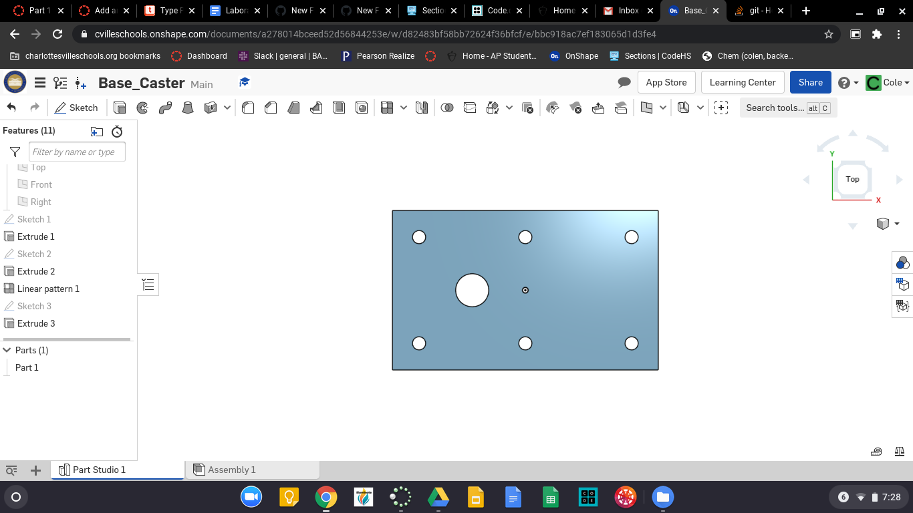

# Basic_OnShape_CAD
Basic CAD from OnShape.
## Base
### Assignment
Contruct the base for the Caster in OnShape.
### Image

### Refelction
The base is a pretty is part in my opinion but it was somewhat harder this time due to the new CAD program, but I think it will get better from this point forward.

## Mount
### Assignment
Construct the Mount Part for the Caster in OnShape.
### Image

### Reflection
Like I said in the last reflection it is only going to get easier, the more I use it the better I'll be with OnShape. That is the only thing that is a problem.

## Fork
### Assignment
Create the Fork part for the Caster assembly in OnShape CAD.
### Image

### Reflection
This assignment was a little bit harder than the others because we had to do somethings that I forgot how to do.

## Tire
### Assignment
Create the Tire for the Wheel of the Caster in OnShape.
###

### Reflection
This Assignment was probably the easiest of the ones we have had, because the only thting you need to do is make a trapzoid and revolve it around an axis and you are done.
